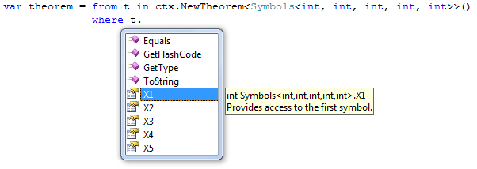
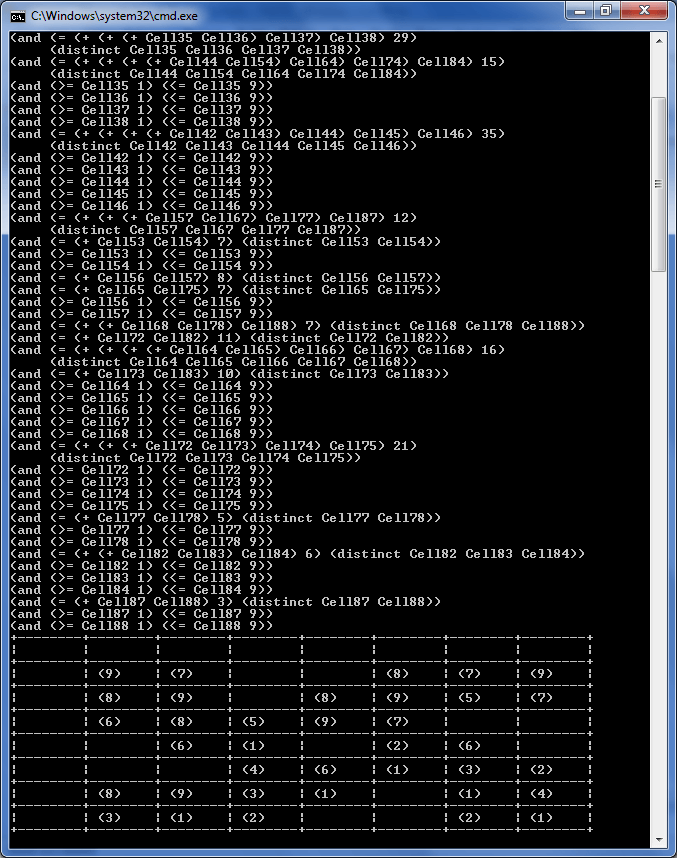
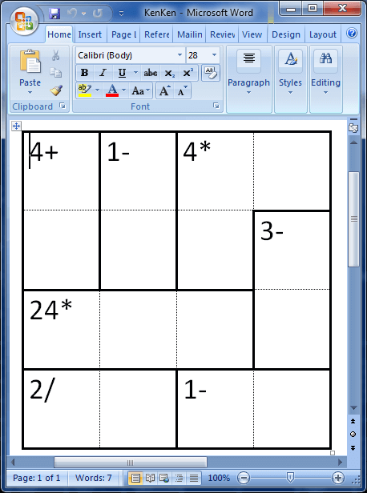
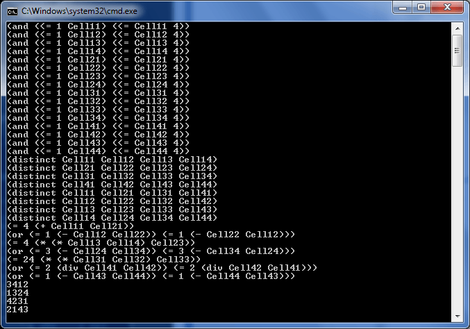

# LINQ to Z3 - Part 02 - LINQ to the unexpected

Sunday, April 19, 2009 3:31 PM

## Introduction

[Last time around](http://community.bartdesmet.net/blogs/bart/archive/2009/04/15/exploring-the-z3-theorem-prover-with-a-bit-of-linq.aspx) in this blog category we looked at using Z3 for testing satisfiability of simple Boolean logic expressions. Obviously Z3 is capable of doing much more, so this time we'll reach out to the domain of integer value arithmetic. Not only that, last time I subtly hinted how this story could continue … with "a bit of LINQ". So I'm very happy to present to you today an "esoteric LINQ binding" implementation: LINQ to Z3.

## LINQ to the unexpected

I'd define esoteric LINQ bindings as "LINQ to the unexpected". Most people live in the mindset of LINQ providers reaching out to "some collection of data locally or remotely", in the `IEnumerable<T>` or `IQueryable<T>` sense of the word. Nothing is further away from the truth; LINQ is nothing more than a syntactical pattern that glues things – operators that is – together in a syntactically silent (as opposed to noisy) way. What I'm talking about in the context of "esoteric LINQ bindings" is the use of language integrated keywords that reduce the noise that would be imposed on the developer otherwise:

```cs
from x in y where x.Bar == 123 select x;
```

becomes (and yes, *in this case* [the select just falls away](http://community.bartdesmet.net/blogs/bart/archive/2008/08/20/what-do-vb-9-0-error-bc36593-expression-of-type-x-is-not-queryable-and-c-3-0-error-cs1936-could-not-find-an-implementation-of-the-query-pattern-for-source-type-x-really-mean.aspx)):

```cs
y.Where(x => x.Bar == 123);
```

Look how much noise (indicated in red) goes away. But what's even more important is that the lambda expressions used in the queries can be translated into gigantic expressions trees to open up for runtime code-as-data inspection. In the world of C# 2.0, the above might have looked as ugly as this:

```cs
ParameterExpression x = Expression.Parameter(typeof(Demo), "x");
Extensions.Where(y, Expression.Lambda(Expression.Equal(Expression.Property(x, typeof(Demo).GetProperty("Bar")), Expression.Constant(123)), x));
```

You'll agree that's not very readable. So in essence, the LINQ syntax is a very convenient gateway to simple meta-programming facilities where expression trees play a central role. And the target of such "queries" is not necessarily some persistent data store. The sky is the limit and that's what we exploit in esoteric LINQ bindings.

Notice I'm speaking about "bindings" not "providers", the latter term being reserved for "query providers" typically (but not necessarily) in the IQueryProvider sense.

# Our mission

With LINQ to Z3 my goal is to abstract away from the low-level Z3 APIs and provide nice syntax with rich static typing support on top of it. The basic idea is the following:

- Define the "shape" of a theorem, e.g. what symbolic names (and their types) to use;
- Express constraints over those symbolic names using LINQ syntax (more specifically the where keyword);
- Ask the resulting object for a solution, resulting in an instance of the "shape" type specified at the start.

An example:

```cs
var theorem = from t in ctx.NewTheorem<Symbols<int, int, int, int, int>>()
              where t.X1 - t.X2 >= 1
              where t.X1 - t.X2 <= 3
              where t.X1 == (2 * t.X3) + t.X5
              where t.X3 == t.X5
              where t.X2 == 6 * t.X4
              select t;

var solution = theorem.Solve();

Console.WriteLine($"X1 = {solution.X1}, X2 = {solution.X2}, X3 = {solution.X3}, X4 = {solution.X4}, X5 = {solution.X5}");
```

In here ctx stands for a `Z3Context` object that can be used to do logging of the internal Z3 expressions being generated by the binding (just like DataContext is used in LINQ to *). We ask the context to new up a `Theorem<T>` by calling `NewTheorem<T>`. Here we use a canned generic Symbols type that has five symbolic names (expressed as properties), each of which are typed to be int in this case.

When writing the LINQ query over this we get full IntelliSense and static typing:



Finally we invoke the Solve method on the theorem; notice our "LINQ expression" is therefore lazy, just like "regular" LINQ expressions are. This also means theorems are composable; we could refine the theorem above by writing one or more query expressions over the existing one:

```cs
var stronger = from t in theorem
               where t.X4 > 0
               select t;
```

The `Solve<T>` method returns an instance of T, where T in our sample stands for the `Symbols<int, …, int>` generic type, so we can print the results to the screen:


As I've enabled logging, you can see the Z3 expressions that were translated from the query expression. You can verify the result printed on the last line satisfies the constraints of the theorem, with many thanks to the Z3 engine.

Ultimately we even want to express more complex theorem solving domains, completely statically typed, over LINQ to Z3. Examples include solving puzzles like Sudoku, Kakuro, KenKen, etc. The sample below illustrates a LINQ query used to solve a [Kakuro puzzle](http://en.wikipedia.org/wiki/Kakuro).

```cs
var u1 = from k in ctx.NewTheorem<Kakuro>()
         where k.Cell11.IsBlack
         where k.Cell14.IsBlack
         where k.Cell15.IsBlack
         where k.Cell24.IsBlack
         where k.Cell48.IsBlack
         where k.Cell51.IsBlack
         where k.Cell61.IsBlack
         where k.Cell85.IsBlack
         where k.Cell12.VerticalSum == 23
         where k.Cell13.VerticalSum == 30
         where k.Cell16.VerticalSum == 27
         where k.Cell17.VerticalSum == 12
         where k.Cell18.VerticalSum == 16
         where k.Cell21.HorizontalSum == 16
         where k.Cell25.VerticalSum == 17
         where k.Cell25.HorizontalSum == 24
         where k.Cell31.HorizontalSum == 17
         where k.Cell34.VerticalSum == 15
         where k.Cell34.HorizontalSum == 29
         where k.Cell41.HorizontalSum == 35
         where k.Cell47.VerticalSum == 12
         where k.Cell52.HorizontalSum == 7
         where k.Cell55.VerticalSum == 7
         where k.Cell55.HorizontalSum == 8
         where k.Cell58.VerticalSum == 7
         where k.Cell62.VerticalSum == 11
         where k.Cell63.VerticalSum == 10
         where k.Cell63.HorizontalSum == 16
         where k.Cell71.HorizontalSum == 21
         where k.Cell76.HorizontalSum == 5
         where k.Cell81.HorizontalSum == 6
         where k.Cell86.HorizontalSum == 3
         select k;
```

The textual representation of this Kakuro is shown below:

```
+--------+--------+--------+--------+--------+--------+--------+--------+
| ****** | 23     | 30     | ****** | ****** | 27     | 12     | 16     |
+--------+--------+--------+--------+--------+--------+--------+--------+
|     16 |        |        | ****** | 17  24 |        |        |        |
+--------+--------+--------+--------+--------+--------+--------+--------+
|     17 |        |        | 15  29 |        |        |        |        |
+--------+--------+--------+--------+--------+--------+--------+--------+
|     35 |        |        |        |        |        | 12     | ****** |
+--------+--------+--------+--------+--------+--------+--------+--------+
| ****** |      7 |        |        | 7    8 |        |        | 7      |
+--------+--------+--------+--------+--------+--------+--------+--------+
| ****** | 11     | 10  16 |        |        |        |        |        |
+--------+--------+--------+--------+--------+--------+--------+--------+
|     21 |        |        |        |        |      5 |        |        |
+--------+--------+--------+--------+--------+--------+--------+--------+
|      6 |        |        |        | ****** |      3 |        |        |
+--------+--------+--------+--------+--------+--------+--------+--------+
```

And here's the output of our solver tackling the theorem. Notice the amount of constraints (it scrolls up!) inferred from this purely declarative Kakuro specification using LINQ:



By the end of this series you'll know exactly how all of this works. We'll go even more crazy and use MGrammar to parse textual representations of puzzles like Kakuro to turn them into an executable piece of code that dynamically builds up LINQ expression trees that are then fed to LINQ to Z3 in order to be solved. And, for the Sudoku and KenKen puzzles we'll read the specification from regular Word tables:



Yes, we'll "execute" the document above to solve the KenKen puzzle inside it using Z3:

```cs
var k3 = KenKen4By4.FromWord(ctx, @"C:\Users\Bart\Desktop\KenKen.docx");
Console.WriteLine(k3.Solve());
Console.WriteLine();
```

[](http://11011.net/software/vspaste)

and here's the verbose logging output with the result printed at the bottom:



Word-to-KenKen-to-LINQ-to-Z3 that is: composability pushed to its limits. But let's try to walk before we start running; first things first: the query pattern.

## The LINQ to Z3 query pattern

Today we'll have a look at how we establish the query pattern with all IntelliSense while writing the query expression. As we've seen before, all we need is the where operator to add constraints to a theorem. But before we can go there, we need to know how to represent a Theorem type. Every theorem has a variable number of symbols it puts constraints on: some theorem might have two Boolean symbols, another might have five integer values, or any mix of the two. There are more types the theorem prover can deal with, such as uninterpreted functions, but to keep things simple we'll omit those for now.

## Instantiating Theorem objects – Option 1

In order for the user to declare the "environment" of a theorem, i.e. the symbols and their types, we can take two different approaches. One is based on nominal types, where the user creates a `Theorem<T>` with T being a type that has the environment defined as a set of properties or so:

```CS
class TwoBools
{
    public bool x { get; set; }
    public bool y { get; set; }
}
```

I'm violating the design guidelines by having properties that do not begin with a capital letter (Pascal-casing), as theorem variables have a mathematical meaning.

But having to define such types every time you want to write a theorem can be painful, so we want more convenient ways to set the scene. One approach is to have a couple of canned generic types with 1 to x number of symbols pre-defined using generic parameter, likeso:

```cs
/// <summary>
/// Pre-defined enviroment with three symbols.
/// </summary>
/// <typeparam name="T1">Type of the first symbol.</typeparam>
/// <typeparam name="T2">Type of the second symbol.</typeparam>
/// <typeparam name="T3">Type of the third symbol.</typeparam>
public sealed class Symbols<T1, T2, T3> : Symbols
{
    /// <summary>
    /// Provides access to the first symbol.
    /// </summary>
    /// <remarks>
    /// Used within definition of theorem constraints and to print the theorem prover's result.
    /// </remarks>
    public T1 X1 { get; private set; }
    /// <summary>
    /// Provides access to the second symbol.
    /// </summary>
    /// <remarks>
    /// Used within definition of theorem constraints and to print the theorem prover's result.
    /// </remarks>
    public T2 X2 { get; private set; }
    /// <summary>
    /// Provides access to the third symbol.
    /// </summary>
    /// <remarks>
    /// Used within definition of theorem constraints and to print the theorem prover's result.
    /// </remarks>
    public T3 X3 { get; private set; }
}
```

The base type simply overrides ToString to provide pretty printing of all the type's properties:

```cs
/// <summary>
/// Base class for symbol container types.
/// </summary>
public class Symbols
{
    /// <summary>
    /// Returns a friendly representation of the symbols and their values.
    /// Used to print the output of a theorem solving task.
    /// </summary>
    /// <returns>Friendly representation of the symbols and their values.</returns>
    public override string ToString()
    {
        var propertyValues = from prop in GetType().GetProperties()
                             let value = prop.GetValue(this, null)
                             select prop.Name + " = " + (value ?? "(null)");
        return "{" + string.Join(", ", propertyValues.ToArray()) + "}";
    }
}
```

While this is already a bit more convenient, it still gets quite verbose and the symbol names are fixed, not quite aligning with the theorem to be expressed:

```cs
var theo = from t in ctx.NewTheorem<Symbols<int, int, int, int, int>>()
           where t.X1 - t.X2 >= 1
           where t.X1 - t.X2 <= 3
           where t.X1 == (2 * t.X3) + t.X5
           where t.X3 == t.X5
           where t.X2 == 6 * t.X4
           select t);
```

Maybe the names X1 to X5 are quite accurate here but we need any number of generic Symbols<…> types (for a Sudoku we'd need one with 81 parameters, and X10 would stand for second row, first column, kind of ugly), so we'd also like to be able to use C#'s capability to create anonymous types (which are somewhat the opposite of nominal types, although they're not quite structural either – the CLR doesn't have structural typing after all – so let's just continue to call them anonymous types because that's what they are :-)) on the fly.

So, instead of specifying a type by its name, we'd like to be able to specify the skeleton "inline":

```cs
ctx.NewTheorem<class { int X; int Y; }>
```

doesn't work though, so we need something a bit smarter. Instead we want the type inference algorithm of C# to help us out. Say we have a NewTheorem<T> method that takes in something of that type T, then we can call the method as follows:

```cs
ctx.NewTheorem(123)
```

without having to specify the type T explicitly as it gets inferred from the first argument. In the sample above it would be inferred to "int". This also allows us to specify an anonymous type without stating it, like this:

```cs
ctx.NewTheorem(new { x = default(int), y = default(int) })
```

Think away the `default(…)` parts an it almost looks like ML-style of variable declaration: x : int, y : int. This has the slight disadvantage of creating an instance of the anonymous type, just to infer its type (as you'll see further on in this series, we won't use the parameter value at all). If you really want to get rid of that as well, you could go for a `Func<T>`:

```cs
Theorem<T> NewTheorem<T>(Func<T> ctor) { … }
ctx.NewTheorem(() => new { x = default(int), y = default(int) });
```

But that's overkill (and yet a bit more of noise).

## Instantiating Theorem objects – Option 2

An alternative, but more complex to implement, way would be to use LINQ syntax "all the way" to establish a theorem proving environment context, using the let keyword. Instead of writing the following:

```cs
var theo = from t in ctx.NewTheorem(new { x = default(int), y = default(int) })
           where t.x == t.y
           select t;
```

we'd now write this:

```cs
var theo = from t in ctx.NewTheorem()
           let x = t.MakeInt()
           let y = t.MakeInt()
           where x == y
           select new { x, y };
```

In the first fragment the range variable t is of type "whatever the anonymous type specified was", hence t.x and t.y resolve to the properties declared in there. In the second fragment, t would be some "theorem constructor assistant" type that has factory methods for the supported theorem symbol types, like Int or Bool. This has several advantages:

- The user is helped not to introduce types that do not make sense (although the let clauses could be used to bring other types in scope);
- The where constraint clause looks very natural.

However, the select part gets a little more involved if we want to extract the resulting values straight away. The main reason I'm not going for this approach right now is its complexity internally. The fragment above translates into:

```cs
var theo = ctx.NewTheorem()
           .Select(t => new { t, x = t.MakeInt() })
           .Select(*1 => new { *1, y = *1.t.MakeInt() })
           .Where(*2 => *2.*1.x == *2.y)
           .Select(*2 => new { x = *2.*1.x, *2.y });
```

What the *1, *2, you might think. What you're seeing here are **transparent identifiers** at work (see the * notation in my [C# 3.0 Query Expression Translation Cheat Sheet](http://community.bartdesmet.net/blogs/bart/archive/2008/08/30/c-3-0-query-expression-translation-cheat-sheet.aspx)). This is a very powerful feature of C# 3.0 that allows you to write seamless query comprehensions code with multiple range variables in scope, but dealing with it from a LINQ binding's perspective gets a bit complicated. I might go there in a future post though, but for now we'll stick with option 1.

## Implementing Where

As stated earlier, we're about to use the "where" clause as a way to specify constraints. In other words, we need a suitable Where method so that LINQ can party on it. Where does that Where method needs to live? Obviously on the return type of the `NewTheorem<T>` method, which – as we saw above – is a `Theorem<T>` on the given context object (to be specified later how the context object looks like). Calling Where should put us back in the world of `Theorem<T>`, so that additional constraints can be specified again.

In order to distinguish the generic-driven query pattern from the underlying theorem solving implementation, we'll have `Theorem<T>` derive from Theorem, where the latter will keep track of the collection of applied constraints.

Now the important bit first: applying Where on a `Theorem<T>` should provide a new instance of a `Theorem<T>` instead of modifying the existing one. This is the case for all LINQ implementations as the query pattern is arbitrarily composable:

```cs
var expensive = from p in products
                where p.Price > 100m
                select p;

var expensiveBeverages = from p in expensive
                         where p.Category == Category.Beverages
                         select p;

var expensiveFruits = from p in expensive
                      where p.Category == Category.Fruits
                      select p;
```

If the second query's Where method were to mutate the "expensive" object by adding more predicates to it, the expensiveFruits query would now query over expensive beverages because expensive got mutated. This is clearly not what we want, so every application of a query operator should provide a new instance of a query object.

This brings us to the implementation part. Notice I've weeded out any of the theorem translating code as that will be subject of the next few posts:

```cs
/// <summary>
/// Representation of a theorem with its constraints.
/// </summary>
public class Theorem
{
    /// <summary>
    /// Z3 context under which the theorem is solved.
    /// </summary>
    private Z3Context _context;

    /// <summary>
    /// Theorem constraints.
    /// </summary>
    private IEnumerable<LambdaExpression> _constraints;

    /// <summary>
    /// Creates a new theorem for the given Z3 context.
    /// </summary>
    /// <param name="context">Z3 context.</param>
    protected Theorem(Z3Context context)
        : this(context, new List<LambdaExpression>())
    {
    }

    /// <summary>
    /// Creates a new pre-constrained theorem for the given Z3 context.
    /// </summary>
    /// <param name="context">Z3 context.</param>
    /// <param name="constraints">Constraints to apply to the created theorem.</param>
    protected Theorem(Z3Context context, IEnumerable<LambdaExpression> constraints)
    {
        _context = context;
        _constraints = constraints;
    }

    /// <summary>
    /// Gets the Z3 context under which the theorem is solved.
    /// </summary>
    protected Z3Context Context
    {
        get
        {
            return _context;
        }
    }

    /// <summary>
    /// Gets the constraints of the theorem.
    /// </summary>
    protected IEnumerable<LambdaExpression> Constraints
    {
        get
        {
            return _constraints;
        }
    }

    /// <summary>
    /// Solves the theorem using Z3.
    /// </summary>
    /// <typeparam name="T">Theorem environment type.</typeparam>
    /// <returns>Result of solving the theorem; default(T) if the theorem cannot be satisfied.</returns>
    protected T Solve<T>()
    {
        // To be covered in the next posts.
    }

    /// <summary>
    /// Returns a comma-separated representation of the constraints embodied in the theorem.
    /// </summary>
    /// <returns>Comma-separated string representation of the theorem's constraints.</returns>
    public override string ToString()
    {
        return string.Join(", ", (from c in _constraints select c.Body.ToString()).ToArray());
    }
}
```

So, the non-generic Theorem type is simply a container for a set of constraints, each of which is a lambda expression, e.g. t => t.x == t.y. Its generic counterpart, `Theorem<T>`, provides the strongly typed query pattern – just Where in our case – on top of it:

```cs
/// <summary>
/// Strongly-typed theorem type for use with LINQ syntax.
/// </summary>
/// <typeparam name="T">Enviroment type over which the theorem is defined.</typeparam>
public class Theorem<T> : Theorem
{
    /// <summary>
    /// Creates a new theorem for the given Z3 context.
    /// </summary>
    /// <param name="context">Z3 context.</param>
    internal Theorem(Z3Context context)
        : base(context)
    {
    }

    /// <summary>
    /// Creates a new pre-constrained theorem for the given Z3 context.
    /// </summary>
    /// <param name="context">Z3 context.</param>
    /// <param name="constraints">Constraints to apply to the created theorem.</param>
    internal Theorem(Z3Context context, IEnumerable<LambdaExpression> constraints)
        : base(context, constraints)
    {
    }

    /// <summary>
    /// Where query operator, used to add constraints to the theorem.
    /// </summary>
    /// <param name="constraint">Theorem constraint expression.</param>
    /// <returns>Theorem with the new constraint applied.</returns>
    public Theorem<T> Where(Expression<Func<T, bool>> constraint)
    {
        return new Theorem<T>(base.Context, base.Constraints.Concat(new List<LambdaExpression> { constraint }));
    }

    /// <summary>
    /// Solves the theorem.
    /// </summary>
    /// <returns>Environment type instance with properties set to theorem-satisfying values.</returns>
    public T Solve()
    {
        return base.Solve<T>();
    }
}
```

Notice how the Where method creates a new instance of `Theorem<T>`, passing in the original context as well as the concatenation of the current constraints with the new constraint.

## A look at the Z3Context type

Finally to finish up this first post, we'll have a peek at the Z3Context type, from which everything starts by creating `Theorem<T>` instances out of it:

```cs
/// <summary>
/// Context object for Z3 theorem proving through LINQ. Manages the configuration
/// of the theorem prover and provides centralized infrastructure for logging.
/// </summary>
public sealed class Z3Context : IDisposable
{
    /// <summary>
    /// Z3 configuration object.
    /// </summary>
    private Config _config;

    /// <summary>
    /// Creates a new Z3 context for theorem proving.
    /// </summary>
    public Z3Context()
    {
        _config = new Config();
        _config.SetParamValue("MODEL", "true");
    }

    /// <summary>
    /// Gets/sets the logger used for diagnostic output.
    /// </summary>
    public TextWriter Log { get; set; }

    /// <summary>
    /// Creates a new theorem based on the given type to establish the environment with
    /// the variables constrained by the theorem.
    /// </summary>
    /// <typeparam name="T">Theorem environment type.</typeparam>
    /// <returns>New theorem object based on the given environment.</returns>
    public Theorem<T> NewTheorem<T>()
    {
        return new Theorem<T>(this);
    }

    /// <summary>
    /// Creates a new theorem based on a skeleton object used to infer the environment
    /// type with the variables constrained by the theorem.
    /// 
    /// This overload is useful if one wants to use an anonymous type "on the fly" to
    /// create a new theorem based on the type's properties as variables.
    /// </summary>
    /// <example>
    /// <code>
    /// ctx.NewTheorem(new { x = default(int), y = default(int) }).Where(t => t.x > t.y)
    /// </code>
    /// </example>
    /// <typeparam name="T">Theorem environment type (typically inferred).</typeparam>
    /// <param name="dummy">Dummy parameter, typically an anonymous type instance.</param>
    /// <returns>New theorem object based on the given environment.</returns>
    public Theorem<T> NewTheorem<T>(T dummy)
    {
        return new Theorem<T>(this);
    }

    /// <summary>
    /// Closes the native resources held by the Z3 theorem prover.
    /// </summary>
    public void Dispose()
    {
        _config.Dispose();
    }

    /// <summary>
    /// Factory method for Z3 contexts based on the given configuration.
    /// </summary>
    /// <returns>New Z3 context.</returns>
    internal Context CreateContext()
    {
        return new Context(_config);
    }

    /// <summary>
    /// Helpers to write diagnostic log output to the registered logger, if any.
    /// </summary>
    /// <param name="s">Log output string.</param>
    internal void LogWriteLine(string s)
    {
        if (Log != null)
            Log.WriteLine(s);
    }
}
```

There's the first little bit of Z3 coming in, with the constructor new'ing up a Z3 context object. It's this context that will provide the entry-point to Z3 theorem solving going forward. Given all of this machinery we can already start writing code like this:

```cs
using (var ctx = new Z3Context())
{
    ctx.Log = Console.Out;
    var theo = from t in ctx.NewTheorem(new { x = default(bool), y = default(bool) })
               where t.x ^ t.y
               select t;
    var result = theo.Solve();
    Console.WriteLine(result);
}
```

Oh, and by the way, we don't have a Select method implemented on `Theorem<T>`. Even though the query above has a projection specified, Select is not required as the projection is a trivial one which gets compiled away by the compiler. When and why this happens you can read in [another blog post of mine](http://community.bartdesmet.net/blogs/bart/archive/2008/08/20/what-do-vb-9-0-error-bc36593-expression-of-type-x-is-not-queryable-and-c-3-0-error-cs1936-could-not-find-an-implementation-of-the-query-pattern-for-source-type-x-really-mean.aspx).

Solve won't do much yet, but that's what we'll be talking about next time. Oooh the suspense :-).